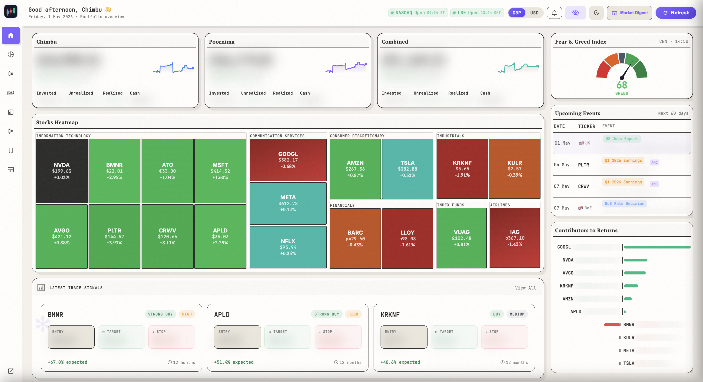

# Trading212 Portfolio Tracker



A full-featured web application that fetches your **Shares ISA** positions from the Trading212 API and displays them in a rich, interactive dashboard. Supports **two named portfolios** simultaneously plus an aggregated **Combined** view.

## Features

### Home / Overview
- Three portfolio cards (Portfolio 1, Portfolio 2, Combined) with live values, returns, and 90-day sparklines
- **Stocks Heatmap** — equal-size live price tiles colour-coded by daily % change, auto-refreshes every 5s from Yahoo Finance
- **Upcoming Events** — earnings, ex-dividend/pay dates, and macro calendar (FOMC, BoE, ECB, US CPI, UK CPI, NFP, GDP) for the next 60 days
- **Fear & Greed Index** — gauge + 30-day history
- Recent combined activity feed
- Top performers (by total return %)
- Market News sidebar (Finviz + Finnhub, refreshes every 5 min)
- Market status pills (NASDAQ + LSE open/close)

### Market View
- Portfolio vs S&P 500 chart (indexed, range-filterable: 1M / 3M / 6M / 1Y / ALL)
- Portfolio gain stats (1M / 6M / 12M / YTD / Total)
- **Drawdown Analysis** chart with Max DD / Current / Days-in-DD stats
- Sector Performance bars (Finviz S&P 500 data)
- Market Signals (Finviz top gainers, losers, signals)
- Insider Trading activity feed
- AI Market Digest (Finviz, Claude, or Gemini — configurable)

### Portfolio Detail (per portfolio or combined)
- Sortable, filterable positions table with allocation bars and 48h sparklines
- Summary cards: total value, P&L, Projected Annual Income (PAI)
- Sector / currency / country allocation bars
- Monthly dividend bar chart
- Analyst ratings (TradingView consensus)
- Trade history
- Upcoming dividend table
- Stock side panel (metrics, price chart, news, analyst ratings, activity)

### Performance Analytics
- Monthly portfolio returns vs SPY benchmark (bar + line chart)
- Risk metrics: TWR, Beta vs S&P 500, Volatility, Sharpe ratio, Sortino ratio, Weighted P/E
- Monthly per-ticker performance heatmap (last 12 months)
- Per-sector return attribution
- Daily/weekly portfolio value change series

### Watchlist
- Add any global ticker with country selection
- Live price + today's % change
- Analyst price targets (Min / Avg / Max) and signal badge
- Fundamentals: Market Cap, Revenue LTM, P/S, P/E (trailing), Forward P/E, 5-year avg P/E
- 48h price sparkline
- **Heatmap tab** (default view) — treemap of all watchlist tickers colour-coded by daily % change, auto-refreshes every 5s with flash animation
- Category tabs with drag-to-reorder
- Persistent storage (survives page reload)

### Price Alerts & Notifications
- Set price alerts for any ticker (above / below threshold, in any currency)
- Alerts evaluated after each background portfolio refresh cycle
- In-app notification inbox with unread count badge
- `GET /api/alerts` · `POST /api/alerts` · `DELETE /api/alerts/<id>`
- `GET /api/notifications` · `POST /api/notifications/read`

### YouTube Feed
- Subscribe to YouTube channels for market/finance content
- Videos fetched and optionally AI-analysed via Gemini on add
- Background refresh keeps the feed current
- `GET/POST /api/yt/channels` · `DELETE /api/yt/channel/<id>` · `GET /api/yt/videos`

### AI Features (optional, requires `SHOW_AI_FEATURES=1`)
- AI Trade Signals (TradingView TA + Gemini analysis) with ticker exclusions
- AI Market Digest (Finviz — no API key required)
- Interactive Gemini chat

---

## Local Development

```bash
# 0. Install uv (once, if not already installed)
curl -LsSf https://astral.sh/uv/install.sh | sh

# 1. One-time setup: creates .venv, installs deps, copies .env.example → .env
make setup

# 2. Edit .env — set TRADING212_API_KEY_1 and any optional keys

# 3. Run
make run        # or: uv run python app.py
```

Open http://localhost:8080

> **Manual setup (without Make):**
> ```bash
> uv sync
> cp .env.example .env
> uv run python app.py
> # or: source .venv/bin/activate && python app.py
> ```

---

## Docker

```bash
make docker      # build image
make docker-run  # run on port 8080
```

---

## Deploy to GCP Cloud Run

Use the release script — it handles git commit, Docker build, push, Cloud Run deploy, and cleanup in one step:

```bash
./scripts/release.sh                 # full release (commit + build + deploy + cleanup)
./scripts/release.sh --no-commit     # skip git commit (already committed)
./scripts/release.sh --no-cleanup    # skip old revision/image pruning
./scripts/release.sh --dry-run       # preview cleanup without deleting
make release                         # same as ./scripts/release.sh
make release ARGS="--no-commit"      # pass flags via make
```

> **git push is manual** — run `git push` after `release.sh` completes.

Store secrets in Secret Manager for production:

```bash
echo -n "your_key" | gcloud secrets create trading212-api-key-1 --data-file=-

gcloud run deploy portfolio-tracker \
  --image $IMAGE \
  --region us-central1 \
  --set-secrets "TRADING212_API_KEY_1=trading212-api-key-1:latest"
```

---

## Environment Variables

| Variable | Default | Description |
|---|---|---|
| `TRADING212_API_KEY_1` | — | Trading212 API key for portfolio 1 |
| `TRADING212_API_KEY_2` | — | Trading212 API key for portfolio 2 (optional) |
| `PORTFOLIO_NAME_1` | `Portfolio 1` | Display name for portfolio 1 |
| `PORTFOLIO_NAME_2` | `Portfolio 2` | Display name for portfolio 2 |
| `TRADING212_BASE_URL` | `https://live.trading212.com` | API base URL (live or demo) |
| `FINNHUB_TOKEN` | — | Finnhub API key (earnings, stock metrics, news) |
| `GEMINI_API_KEY` / `GOOGLE_API_KEY` | — | Gemini API key (AI features + YouTube analysis) |
| `SHOW_AI_FEATURES` | `0` | Set to `1` to enable AI tab in the UI |
| `PORT` | `8080` | HTTP port (Cloud Run sets this automatically) |
| `DB_PATH` | `portfolio_cache.db` | SQLite database path |
| `DATABASE_URL` | — | PostgreSQL DSN — overrides SQLite when set |
| `CACHE_TTL_SECONDS` | `600` | Portfolio rows cache TTL (seconds) |
| `CACHE_TTL_INSTRUMENTS` | `3600` | Instrument metadata TTL |
| `CACHE_TTL_DIVIDENDS` | `1800` | Dividend data TTL |
| `CACHE_TTL_FX` | `300` | FX rate TTL |
| `CACHE_TTL_ORDERS` | `300` | Order history TTL |
| `AUTO_REFRESH_SECONDS` | `300` | Background portfolio refresh interval |

---

## Trading212 API Key

Generate your key at **Settings → API (Beta)** in your Trading212 account. Grant at minimum: **Portfolio read**, **History read**.
